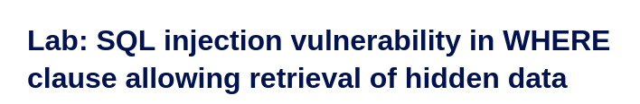
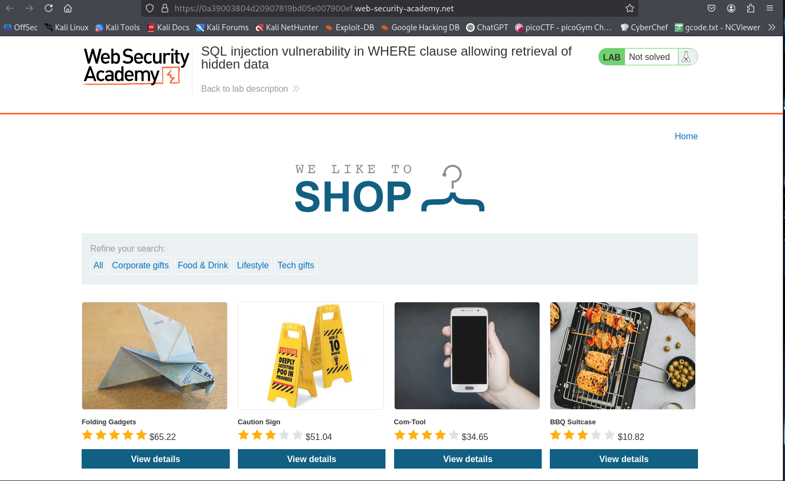
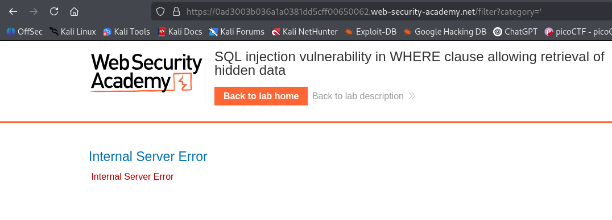
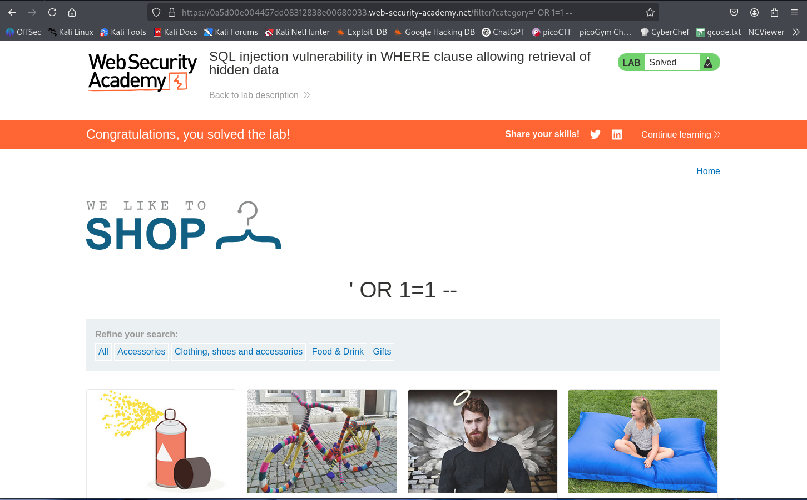

# LAB 1 — SQL Injection in Category Filter



---

This lab contains a SQL injection vulnerability in the product category filter. When the user selects a category, the application executes a query like:

```sql
SELECT * FROM products WHERE category = 'Gifts' AND released = 1
```

The goal: perform a SQL injection that causes the application to display one or more **unreleased** products.

---

## Lab walkthrough



If you choose a category such as **Lifestyle** (or Corporate Gifts, Food & Drink, Tech Gifts, etc.), you'll see the category reflected in the URL:


The lab uses the following query on the server:

```sql
SELECT * FROM products WHERE category = 'Gifts' AND released = 1
```

### Step 1 — Confirm injection reaches the database
I submitted a single quote character (`'`) as the `category` parameter in the URL:
```
/filter?category='
```
The application returned an **Internal Server Error (500)** and a generic error page:



A 500 caused by an unterminated string shows the input reached the SQL layer and broke the query — good evidence the parameter is injectable.

### Step 2 — Simple injection to bypass the `released` filter
A classic payload is:
```
' OR 1=1 --
```
`OR 1=1` is always true, and `--` starts a SQL comment that ignores the rest of the original WHERE clause. URL-encoded, use:



This alters the query to something like:
```sql
SELECT * FROM products WHERE category = '' OR 1=1 --' AND released = 1
```
Because `OR 1=1` makes the WHERE condition true for all rows and the `--` comments out `AND released = 1`, the application returns products regardless of the `released` flag — unreleased products become visible.

**Result:** Unreleased products are displayed.

---

## PoC payloads
- Plain: `' OR 1=1 --`  

---

## Short recommendations (improvements to fix the issue)
1. **Use parameterized queries / prepared statements** — never concatenate user input into SQL strings.  
2. **Whitelist categories** — validate `category` server-side against known category names.  
3. **Least privilege** — use a database account with minimal permissions.  
4. **Proper error handling** — do not expose SQL errors to users; log internally and show a generic message.  
5. **WAF / input filtering** — consider blocking obvious SQL metacharacters at the edge while fixing the root cause.

---

## Severity
High — this vulnerability allows logic bypass (the `released` check) and can expose sensitive or unreleased data.

---
