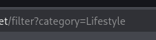

# LAB 1:

--
This lab contains a SQL injection vulnerability in the product category filter. When the user selects a category, the application carries out a SQL query like the following: 
```
SELECT * FROM products WHERE category = 'Gifts' AND released = 1
```
- To solve the lab, perform a SQL injection attack that causes the application to display one or more unreleased products. 

## lets access the lab:
--

--
if you to the "lifestyle" or any of (corporate gifts, food & Drink, teach gifts),
you can see this in the url:
--

--
and the lab gave is this query:
``` 
SELECT * FROM products WHERE category = 'Gifts' AND released = 1
```
I submitted a single quote character (') as the category parameter value in the URL:
*/filter?category=*
The application returned an Internal Server Error (HTTP 500) and displayed a generic error page 
--

--
- That 500 tells you the input reached the DB/query layer and caused a SQL error (unterminated string / syntax error). Good — injection is possible.
- lets try the simplest sql injection *OR 1=1 --*
- OR 1=1 — this is a boolean condition that is always true. If inserted into a WHERE clause it can make the whole condition evaluate true for every row.

- -- — this starts a SQL comment (in many SQL dialects), which causes the rest of the original query (anything after the comment marker) to be ignored.
--

--
and Gongrats!!

