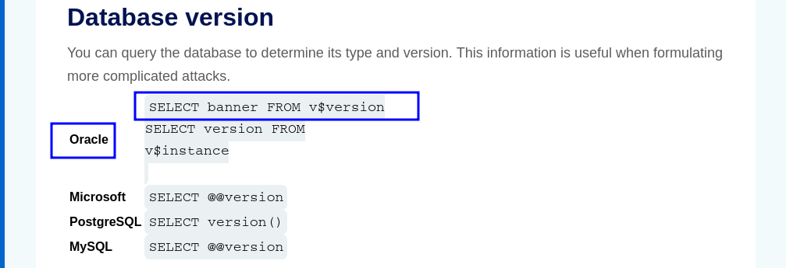

# LAB 3 — SQL Injection (UNION-based) Writeup


---

## Summary
This lab contains a SQL injection vulnerability in the product category filter. You can use a `UNION SELECT` attack to retrieve results from an injected query. The goal: **display the database version string**.

---

## Hint
On Oracle databases, every `SELECT` statement must specify a table to select `FROM`. If your `UNION SELECT` attack does not query from a table, you must include `FROM` followed by a valid table name.

There is a built-in table on Oracle called `dual` you can use for this purpose. Example:
```sql
UNION SELECT 'abc' FROM dual
```

---

## Walkthrough


Choose any category. In this example: **gifts**.


The only input on this page is the category filter, so this is the injection point.


When testing with a single quote (`'`) the server returns an internal error — the application is vulnerable to SQL Injection.

---

### Step 1 — Determine number of columns
Before performing a `UNION SELECT` attack, determine:

1. How many columns the original query returns.
2. The data types of each column.

Use `ORDER BY <n>` to probe column count. The largest `n` that does not error equals the column count.

Procedure:
1. Inject `'+ ORDER BY 1--` and observe.
2. Repeat with `ORDER BY 2--`, `ORDER BY 3--`, ... until the server errors.
3. The last `n` that succeeded is the number of columns you must match in the `UNION SELECT`.


Here we got an error on `' ORDER BY 3--`.  
Therefore the number of columns is **2**.

So the `UNION` template should match two columns:
```sql
UNION SELECT 1, 2 FROM dual
```

---

### Step 2 — Extract database version
We need the database version string. On Oracle, version info is available from `v$version`. Construct a `UNION SELECT` matching two columns and returning the version in one column.

Example payload:
```sql
' UNION SELECT banner, NULL FROM v$version--
```

Injecting that returns the database banner string (version).  
Result shown:


---

## Conclusion
- The category filter is vulnerable to UNION-based SQL injection.
- There are 2 columns in the original query.
- Using `UNION SELECT banner, NULL FROM v$version--` reveals the Oracle database version.

---

## Reference — SQL Injection Cheat Sheet

PortSwigger's SQL Injection cheat sheet (useful examples and payloads):

[PortSwigger SQL Injection Cheat Sheet](https://portswigger.net/web-security/sql-injection/cheat-sheet)


